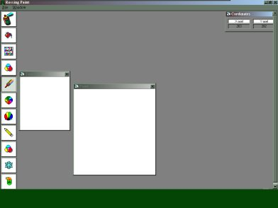



## Paint

### Description

***(Updated)***

A useful paint program for the beginner with all the tools you want from a paint program. You must download this code. And it´s almost totally free from bugs. (vote, vote, vote)
 
### More Info
 

             |
---                |---
**Submitted On**   |2001-04-25 08:33:40
**By**             |[Jonathan Rossing](https://github.com/Planet-Source-Code/PSCIndex/blob/master/ByAuthor/jonathan-rossing.md)
**Level**          |Beginner
**User Rating**    |3.5 (21 globes from 6 users)
**Compatibility**  |VB 6\.0
**Category**       |[Graphics](https://github.com/Planet-Source-Code/PSCIndex/blob/master/ByCategory/graphics__1-46.md)
**World**          |[Visual Basic](https://github.com/Planet-Source-Code/PSCIndex/blob/master/ByWorld/visual-basic.md)
**Archive File**   |[Paint188074252001\.zip](https://github.com/Planet-Source-Code/jonathan-rossing-paint__1-15181/archive/master.zip)

